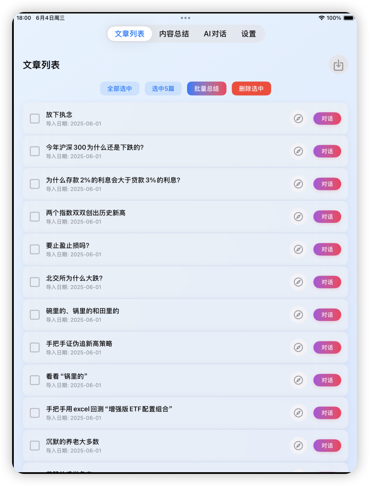
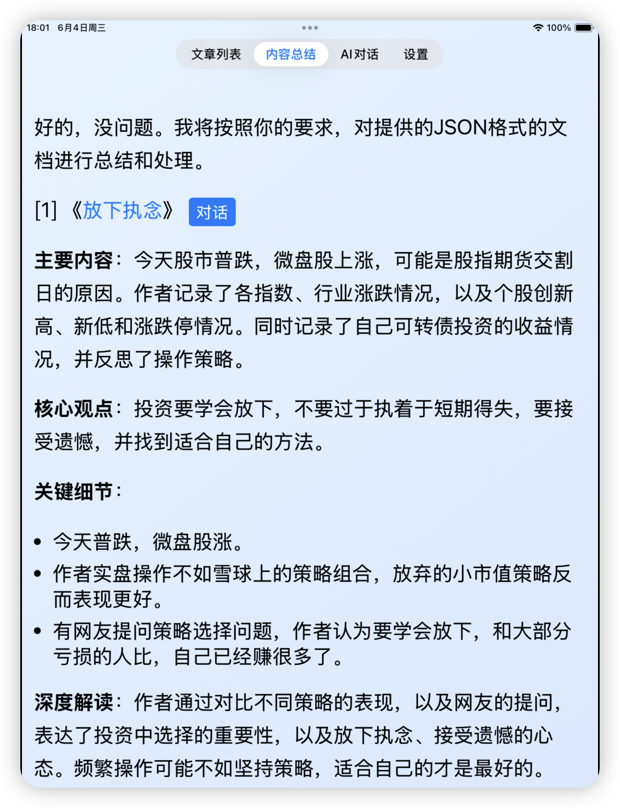
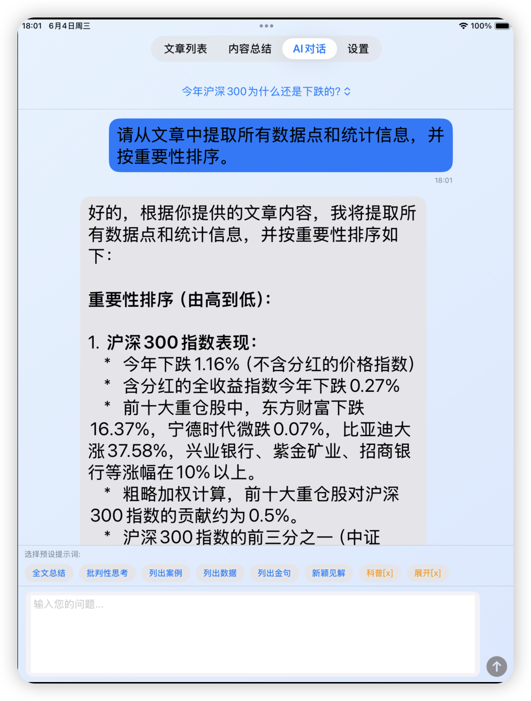
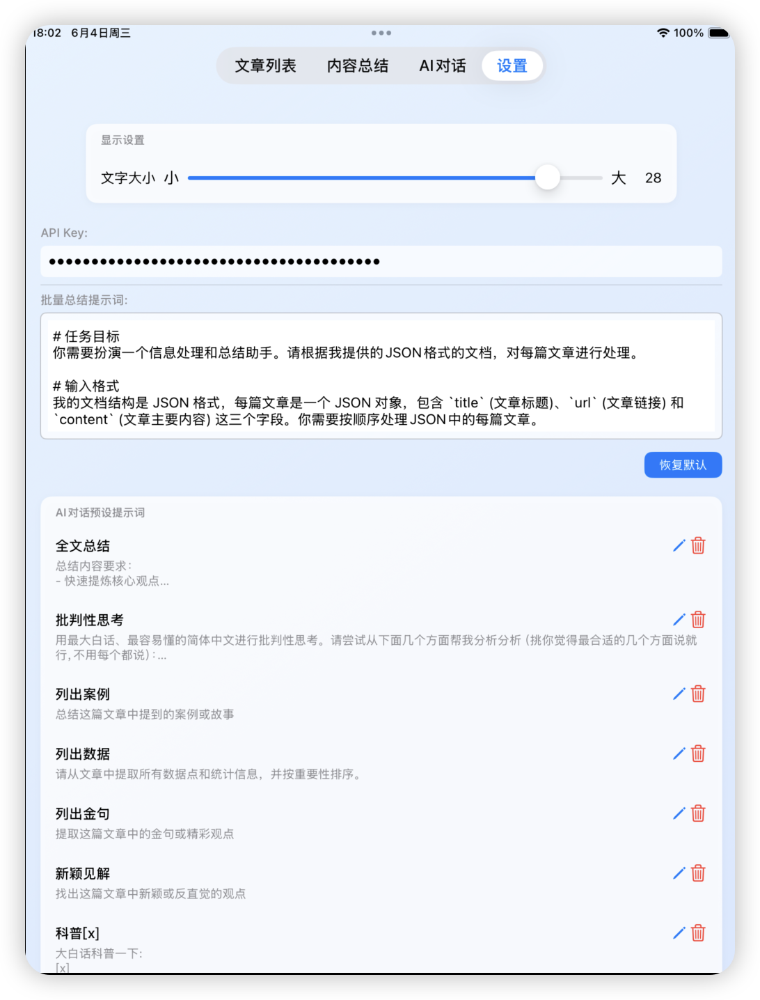

# LumiRead

LumiRead 是一个 iPad 应用程序，旨在帮助用户导入文章、生成内容总结以及与 AI 进行文章相关的对话。该应用集成了Google Gemini API 进行 AI 处理，并使用 Core Data 进行本地数据存储。

## 主要功能

- **文章导入**: 支持从本地 JSON 文件导入文章。
- **内容总结**: 利用 AI 对文章进行批量总结。
- **AI 对话**: 与 AI 就指定文章进行互动式问答。
- **文字大小调整**: 在设置中可以调整 AI 对话和内容总结页面的文字大小。
- **数据持久化**: 使用 Core Data 存储文章、总结和聊天记录。

## 项目结构

项目采用 SwiftUI 和 Core Data 构建，遵循 MVVM 架构模式，主要包含以下组件：

- **Models**: Core Data 实体定义 (Article, BatchSummary, Chat, Message, PresetPrompt, Settings)。
- **Views**: SwiftUI 视图组件 (ContentView, ArticleListView, SummaryView, AIChatView, SettingsView)。
- **ViewModels**: 视图模型，负责视图的状态管理和业务逻辑。
- **Services**: 业务逻辑服务 (GeminiService)。
- **Persistence**: Core Data 持久化控制器。

## 安装与运行

```bash
# Clone the repository
git clone <repository_url>

# Open the project in Xcode
open LumiReader.xcodeproj

# Select your target device (iPad) and run the app
```

## 配置

-待补充...

### Gemini API Key

在“设置” Tab 中，输入您的 Google Gemini API Key。这是使用 AI 对话和批量总结功能的必要条件。

### 批量总结提示词

在“设置” Tab 中，可以自定义用于批量总结文章的提示词。

### 预设提示词

在“设置” Tab 的“AI对话预设提示词”部分，可以管理用于 AI 对话的预设提示词，包括添加、编辑和删除。

### 文字大小

在“设置” Tab 的“显示设置”部分，可以使用滑块调整 AI 对话和内容总结页面的文字大小。

## 应用截图

以下是 LumiRead 的主要界面的截图：

### 文章列表



### 批量总结



### AI 对话



### 设置



